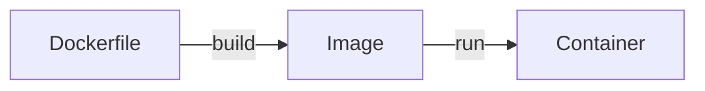

# docker-demo

Tiny Node.js app used to demonstrate the basic Docker workflow: **Dockerfile → image → container**.

## Dockerfile - Build instructions



## In this repo
- We will **write a Dockerfile** for a Node.js application
- Then, **build a Docker image** from it and **run a container**

## Project Tree
```
|- src
    |- server.js
|- package.json
|- Dockerfile       # Instructions for how to build the Docker image for this app
```

## Docker commands
### Build an image from the `Dockerfile`

```bash
docker build -t docker-demo-app:1.0 .
```

<details>
<summary>Example build output</summary>

```text
[+] Building 13.1s (11/11) FINISHED                                               docker:desktop-linux
 => [internal] load build definition from Dockerfile                                              0.0s
 => => transferring dockerfile: 600B                                                              0.0s
 => [internal] load metadata for docker.io/library/node:25-alpine                                 3.6s
 => [auth] library/node:pull token for registry-1.docker.io                                       0.0s
 => [internal] load .dockerignore                                                                 0.0s
 => => transferring context: 2B                                                                   0.0s
 => [1/5] FROM docker.io/library/node:25-alpine@sha256:f4769ca6eeb6ebbd15eb9c8233afed856e437b75f  7.0s
 => => resolve docker.io/library/node:25-alpine@sha256:f4769ca6eeb6ebbd15eb9c8233afed856e437b75f  0.0s
 => => sha256:a55ef3956e1fcc1fc199e13222c3a68cffd1cc6eb441fa8a00d00cea5b34e1b3 444B / 444B        0.6s
 => => sha256:2335f664971689755bd82207131a4ff08f008d5758e40a7fb3756b46454fb345 1.26MB / 1.26MB    1.0s
 => => sha256:c415edfd429112e95b3067969bf0b4aad289b28830f9f7a3229ac192df8bec2e 53.14MB / 53.14MB  6.3s
 => => sha256:f6b4fb9446345fcad2db26eac181fef6c0a919c8a4fcccd3bea5deb7f6dff67e 4.20MB / 4.20MB    1.7s
 => => extracting sha256:f6b4fb9446345fcad2db26eac181fef6c0a919c8a4fcccd3bea5deb7f6dff67e         0.1s
 => => extracting sha256:c415edfd429112e95b3067969bf0b4aad289b28830f9f7a3229ac192df8bec2e         0.7s
 => => extracting sha256:2335f664971689755bd82207131a4ff08f008d5758e40a7fb3756b46454fb345         0.0s
 => => extracting sha256:a55ef3956e1fcc1fc199e13222c3a68cffd1cc6eb441fa8a00d00cea5b34e1b3         0.0s
 => [internal] load build context                                                                 0.0s
 => => transferring context: 478B                                                                 0.0s
 => [2/5] COPY package.json /app/                                                                 0.1s
 => [3/5] COPY src /app/                                                                          0.0s
 => [4/5] WORKDIR /app/                                                                           0.0s
 => [5/5] RUN npm install                                                                         1.8s
 => exporting to image                                                                            0.5s
 => => exporting layers                                                                           0.3s
 => => exporting manifest sha256:fb959e9361d88b26c596537bea91a83a4ab092df064e3721fcdb1eb764542d6  0.0s
 => => exporting config sha256:cd845f47c3b3848a6738a967d5405a9f6beff41ec4a237ef53945a7f79e76e5b   0.0s
 => => exporting attestation manifest sha256:4152f55b5f1a1d654dec021c6112aabafbaa5d77da962c1dde2  0.0s
 => => exporting manifest list sha256:cc6d23bd94af7ad1c16ef653b67632c82957813e718cde2f1fe998029f  0.0s
 => => naming to docker.io/library/docker-demo-app:1.0                                            0.0s
 => => unpacking to docker.io/library/docker-demo-app:1.0                                         0.1s

View build details: docker-desktop://dashboard/build/desktop-linux/desktop-linux/zqsvzujppv234nqod79ot
```
</details>

### View the image details

```bash
docker images
```

```text
IMAGE                                   ID             DISK USAGE   CONTENT SIZE   EXTRA
docker-demo-app:1.0                     cc6d23bd94af        248MB         61.5MB        
```

### Run the image as a container

```bash
docker run -d --name docker-demo -p 3000:3000 docker-demo-app:1.0
```

### Verify it works

- Visit `http://localhost:3000/` in the browser (you should see `Welcome to the Docker demo application!`)
- Or from the CLI:

```bash
curl -s http://localhost:3000/
```

### View the logs

```bash
docker logs -f docker-demo
```

```text
Server is running (i.e., app is listening) on port 3000
```

### Stop and remove the container

```bash
docker rm -f docker-demo
```